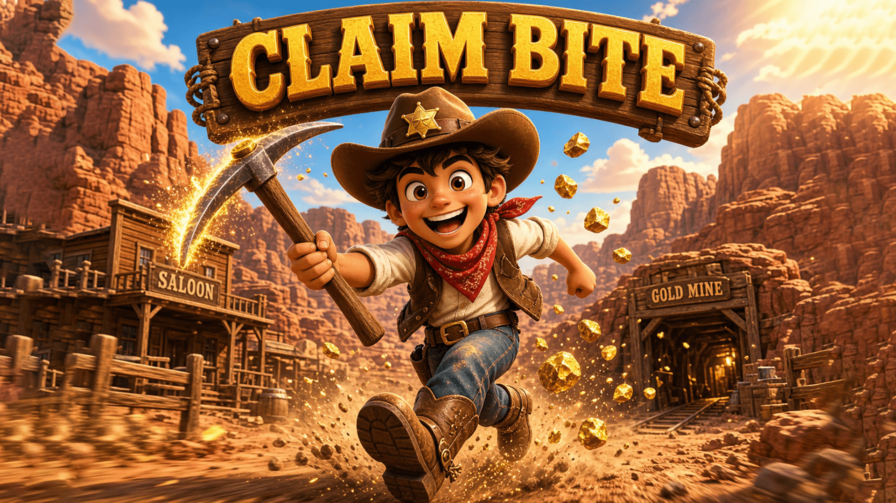

# Claim Bite

<p align="center">
  
</p>

A Decentraland SDK7 scene set in a half-abandoned gold-rush mining town.

You arrive as a stranger with a pick. Tap in time with the swing bar to break ore out of the rock,
carry it to the bank in town, and sell it for coins — the only legal tender. Every sale pushes the
town's ore price down for everyone, and it recovers slowly, so *when* you sell is the decision the
game is built on. Coins buy better tools and rent a claim out at the quarry, where an idle rig keeps
producing while you are away.

The game runs on an authoritative server: mining, selling and buying are requests, and balances and
the shared market price come back from the server, so the town is the same town for everyone in it.

**Deployment target:** World `carlosmu.dcl.eth`

## Design documents

The design lives in [`design/`](design) — the [GDD](design/gdd.md), an append-only
[decision log](design/decisions.md), the [hypothesis log](design/hypothesis-log.md) and
[ideas](design/ideas.md).

## Run it

**With the Creator Hub (recommended)**

1. Download this repository.

2. Install the [Creator Hub](https://decentraland.org/download/creator-hub), the official desktop app for creating, previewing, and publishing Decentraland scenes.

3. In the **Scenes** tab, import this scene's root folder.

4. Press **Preview** to explore the scene in Decentraland.

**With the command line**

Inside this scene's root directory run:

```
npm install
npm run start
```

`npm run build` type-checks and bundles the scene, `npm run deploy` publishes it.

**With an AI coding assistant**

If you build with an AI coding assistant (Claude Code, Cursor, GitHub Copilot, and others), install the official Decentraland SDK Skills first. They teach your agent verified SDK7 patterns for every topic: scene creation, 3D models, interactivity, UI, multiplayer, deployment, and more.

```
npx skills add decentraland/sdk-skills
```

See [Vibe Coding with AI](https://docs.decentraland.org/creator/scenes-sdk7/getting-started/vibe-coding) for the full guide.
